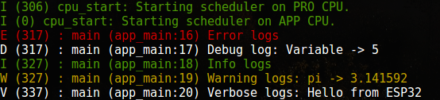

# ESP32 Logger

Logging library for ESP32 providing improved logging to ESP-IDF projects.

## Table of Contents

* [Introduction](#introduction)
* [Requirements](#requirements)
* [Installation](#installation)
* [Disclaimer](#disclaimer)
* [Example](#example)
* [To-do](#to-do)
* [Projects](#projects)
* [Contributors](#contributors)
* [References](#references)
* [License](#license)

## Introduction
Debugging a microcontroller can be a tedious task and often requires special hardware. Many developers prefer to use the good old ```printf()```, which can cause problems when the format string size becomes large.

Also, the ESP_LOG(V/D/I/W/E) are intended to implement "permanent" logging functionality in the code and is also used in the ESP-IDF itself, where depending on the debugging scenario it is possible to globally or locally enable required verbosity levels of information to receive.

### Features

- Printing format strings in an efficient manner
- Support for Tags (as in Android logging) and show the function name and line number from where the log origins

## Requirements
* ESP-IDF v4.0 or later

## Installation
To use this logger in IDF project, follow these steps:- 
```
cd <your_esp_idf_project>
mkdir components
cd components
git clone <repository>
```
If you are using the already using the ESP-IDF logging component, just replace ```#include "esp_log.h"``` by ```"#include "logger.h"```.

## Disclaimer

This library is a just a wrapper for the original ESP-IDF logging library with some added features and it helps us debug our projects without any difficulty. Parameters like thread safety, heap fragmentation have never been encountered and tested by us. So, if you face any problems, raise an issue. Also, as this library does not use the ESP_EARLY_LOG functionality, it cannot be used to print logs in ISRs.

## Example
```C
#include "logger.h"
static const char *TAG = "main";

void app_main(void)
{
    int a = 5;
    float pi = 3.141592f;
    char *str = "Hello from ESP32";

    logE(TAG, "Error logs");
    logD(TAG, "Debug log: Variable -> %d", a); 
    logI(TAG, "Info logs");       
    logW(TAG, "Warning logs: pi -> %f", pi);       
    logV(TAG, "Verbose logs: %s", str);
}
```

### Output

<p align="center">
    <kbd></kbd>
</p>

## To-do
* Heap and thread-safety analysis when logs are being printed from multiple threads
* Logging to file (on SPIFFS / SD) - with thread safety locks
* Printing logs in ISRs

## Projects
* [sra-board-component](https://github.com/SRA-VJTI/sra-board-component)
* [OTA_update_STM32_using_ESP32](https://github.com/laukik-hase/OTA_update_STM32_using_ESP32)

__Note: In case you are using this in your project, let us know - we will feature it here!.__

## Contributors
* [Laukik Hase](https://github.com/laukik-hase)
* [Udit Patadia](https://github.com/udit7395)
* [Gautam Agrawal](https://github.com/gautam-dev-maker)
* [Shreyas Atre](https://github.com/SAtacker)

## References
* [log.c](https://github.com/rxi/log.c) by [RXI](https://github.com/rxi)
* [Esp-Idf-Improved-Logging](https://github.com/JoaoLopesF/Esp-Idf-Improved-Logging) by [JoaoLopesF](https://github.com/JoaoLopesF)

## License

Distributed under the MIT License. See ```LICENSE``` for more information.
